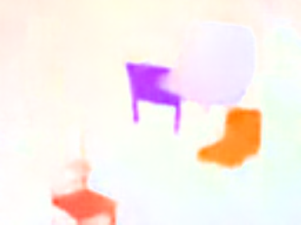

# theano-flownet

This is a port of the caffe implementation of the ICCV'15 paper "[FlowNet: Learning
Optical Flow with Convolutional Networks](http://lmb.informatik.uni-freiburg.de/Publications/2015/DFIB15/flownet.pdf)" by Dosovitskiy et al to Theano and Lasagne. It contains both
FlowNetS and FlowNetC models and a port of the correlation layer.

Ground Truth                                  | FlowNetS                                      | FlowNetC
----------------------------------------------|-----------------------------------------------|----------------------------------------------------
| | 

### Requirements

* flownet-caffe (for the weight conversion script only).
* Theano 0.8.2
* Lasagne
* numpy
* [flow-io-opencv](https://github.com/davidstutz/flow-io-opencv) can be used to generate optical flow
visualization from *.flo outputs

### Setup

`caffe_to_numpy.py` script can be used to convert caffe models to the npz format.
caffemodel and prototxt files should be placed in the model subdirectory. Alternatively you can download weights from [Google Drive](https://drive.google.com/file/d/0B_f8lHMYsLosSlBodTdSNlZ3TEk/view?usp=sharing).

### Running

```bash
python FlowNetS.py
python FlowNetC.py
```
### License

The source code is distributed under the [MIT license](LICENSE). Please refer to us if you find this code useful.
